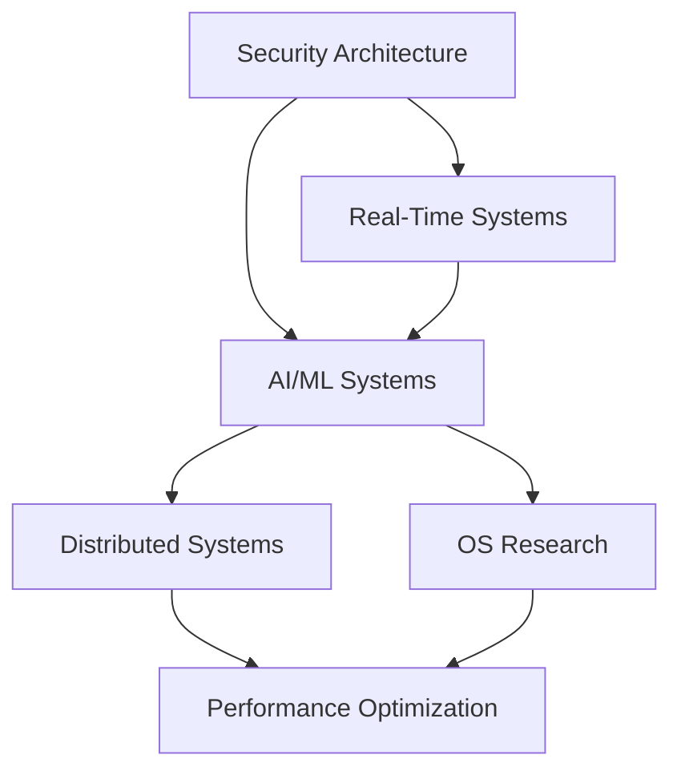

# SIS Kernel: Beyond the Horizon Implementation Guide
**Version 2.0 | September 2025**

*Comprehensive implementation roadmap for vertical expansion of the SIS AI-native microkernel from research prototype to enterprise-grade distributed system*

---

## Executive Summary

The SIS (Secure Intelligence System) Kernel represents a paradigm shift in operating system design—the world's first AI-native, security-first, distributed microkernel. This document serves as the definitive implementation guide for transforming the current ARM64 QEMU-based prototype into an enterprise-grade system capable of competing with research from Google, Microsoft, Apple, and leading academic institutions.

**Current State**: Functional ARM64 microkernel with UEFI boot, MMU, GICv3, VirtIO, and basic syscall framework  
**Target State**: AI-native distributed microkernel with hardware security, real-time ML inference, Byzantine fault tolerance, and enterprise scalability  
**Development Approach**: QEMU-first implementation for rapid prototyping and validation before hardware deployment  

---

## Table of Contents

1. [Architecture Overview](#architecture-overview)
2. [Implementation Tracks](#implementation-tracks)
3. [Phase-by-Phase Development](#phase-by-phase-development)
4. [Technical Implementation Details](#technical-implementation-details)
5. [Integration Architecture](#integration-architecture)
6. [Validation Framework](#validation-framework)
7. [Research Foundation](#research-foundation)
8. [Future Roadmap](#future-roadmap)

---

## Architecture Overview

### The HYPERCUBE Architecture

The SIS Kernel follows a multi-dimensional scaling architecture we call **HYPERCUBE**:

```
┌─────────────────────────────────────────────────────────┐
│                    HYPERCUBE DIMENSIONS                 │
├─────────────────────────────────────────────────────────┤
│ SECURITY    │ AI/ML        │ DISTRIBUTED  │ PERFORMANCE │
│ ────────────│──────────────│──────────────│─────────────│
│ • TrustZone │ • TinyML     │ • Consensus  │ • Lock-Free │
│ • Caps      │ • NPU Accel  │ • Clustering │ • Cache Opt │
│ • TPM Boot  │ • RT Infer   │ • Migration  │ • SMP Scale │
│ • Side-Ch   │ • Fed Learn  │ • Load Bal   │ • NUMA Opt  │
└─────────────────────────────────────────────────────────┘
```

### Core Design Principles

1. **AI-Native**: ML inference and decision-making integrated at kernel level
2. **Security-First**: Capability-based access control with hardware security roots
3. **QEMU-First**: All features validated in emulation before hardware deployment
4. **Research-Backed**: Every implementation grounded in peer-reviewed research
5. **Enterprise-Ready**: Production scalability and reliability from day one

---

## Implementation Tracks

Based on comprehensive multi-AI consultation, we identified six critical implementation tracks:

### Track 1: Security Architecture Expert
**Focus**: TrustZone, TPM, SMMU, Capability Systems  
**Research Lead**: ARM TrustZone Technology Guide, seL4 Verification  
**Target**: Hardware-backed security with formal verification  

### Track 2: Machine Learning Systems Architect  
**Focus**: TinyML, NPU Integration, Real-Time Inference  
**Research Lead**: TensorFlow Lite Micro, Intel Loihi Neuromorphic  
**Target**: <10μs ML inference latency in kernel space  

### Track 3: Operating Systems Research Expert  
**Focus**: SMP, NUMA, Advanced Scheduling, Microkernel Design  
**Research Lead**: L4 Microkernel Family, Linux CFS/BPF Schedulers  
**Target**: Multi-core scalability with deterministic behavior  

### Track 4: Real-Time Systems Expert  
**Focus**: Deterministic Scheduling, Interrupt Latency, WCET Analysis  
**Research Lead**: PREEMPT_RT, Rate Monotonic Analysis  
**Target**: Hard real-time guarantees for AI workloads  

### Track 5: Distributed Systems Architect  
**Focus**: Consensus, Clustering, Byzantine Fault Tolerance  
**Research Lead**: Raft, HotStuff BFT, Distributed Hash Tables  
**Target**: Multi-node coordination with fault tolerance  

### Track 6: Performance Engineering Expert  
**Focus**: Cache Optimization, Memory Bandwidth, Profiling  
**Research Lead**: Intel Optimization Manual, ARM Performance Guides  
**Target**: Near-native performance in QEMU, optimal scaling  

---

## Phase-by-Phase Development

### Phase 1: Foundation (Months 1-2)
**Objective**: Establish robust QEMU development environment and basic multi-core capabilities

#### 1.1 QEMU Environment Setup
```bash
#!/bin/bash
# SIS Kernel Development Environment Setup

# Install dependencies
sudo apt-get update
sudo apt-get install -y qemu-system-aarch64 qemu-utils swtpm \
  libvirt-daemon-system libvirt-clients bridge-utils \
  ninja-build meson pkg-config

# Create development structure
mkdir -p $HOME/sis-expansion/{
  qemu-configs,
  build-scripts,
  test-suites,
  performance-analysis,
  security-validation,
  distributed-testing
}

# Build custom QEMU with SIS extensions (optional)
git clone https://gitlab.com/qemu-project/qemu.git
cd qemu
git checkout v8.1.0
./configure --target-list=aarch64-softmmu --enable-debug
make -j$(nproc)
```

#### 1.2 Multi-Core Foundation
**Implementation Priority**: SMP bring-up with GICv3

```rust
// src/kernel/smp.rs
use crate::arch::gic::GicV3;
use crate::mm::physmem::PhysAddr;

pub struct SmpConfig {
    pub max_cpus: usize,
    pub boot_cpu: CpuId,
    pub cpu_topology: CpuTopology,
}

impl SmpInit {
    pub fn bring_up_secondary_cpus() -> Result<(), SmpError> {
        // Parse device tree for CPU configuration
        let dt_cpus = parse_cpu_nodes()?;
        
        // Initialize GICv3 redistributors
        for cpu in dt_cpus.iter() {
            GicV3::init_redistributor(cpu.mpidr)?;
        }
        
        // Boot secondary CPUs via PSCI
        for cpu in dt_cpus.iter().skip(1) {
            psci_cpu_on(cpu.mpidr, secondary_entry_point())?;
        }
        
        Ok(())
    }
}
```

**QEMU Configuration**:
```bash
qemu-system-aarch64 \
  -machine virt,gic-version=3,iommu=smmuv3 \
  -cpu cortex-a57 \
  -smp 4,cores=4,threads=1,sockets=1 \
  -m 4G \
  -numa node,memdev=mem0,cpus=0-1 \
  -numa node,memdev=mem1,cpus=2-3 \
  -object memory-backend-ram,id=mem0,size=2G \
  -object memory-backend-ram,id=mem1,size=2G
```

#### 1.3 Performance Monitoring Infrastructure
```rust
// src/kernel/perf.rs
pub struct PerformanceMonitor {
    pmu_counters: [PmuCounter; 8],
    sampling_rate: Duration,
    event_buffer: RingBuffer<PerfEvent>,
}

impl PerformanceMonitor {
    pub fn profile_function<T, F>(&self, name: &str, func: F) -> T 
    where F: FnOnce() -> T {
        let start_cycles = read_cycle_counter();
        let start_instructions = read_instruction_counter();
        
        let result = func();
        
        let end_cycles = read_cycle_counter();
        let end_instructions = read_instruction_counter();
        
        self.record_performance_data(PerfEvent {
            name: name.into(),
            cycles: end_cycles - start_cycles,
            instructions: end_instructions - start_instructions,
            timestamp: current_time(),
        });
        
        result
    }
}
```

### Phase 2: Security Architecture (Months 3-4)
**Objective**: Implement enterprise-grade security foundation

#### 2.1 TrustZone Integration
**Research Foundation**: ARM TrustZone Technology Guide, OP-TEE Architecture

```bash
# Build OP-TEE for QEMU integration
mkdir -p $HOME/optee-qemu && cd $HOME/optee-qemu
repo init -u https://github.com/OP-TEE/manifest.git -m qemu_v8.xml
repo sync -j$(nproc)

# Build secure world components
make -j$(nproc) CFG_ARM64_core=y PLATFORM=vexpress-qemu_virt

# Launch with secure world enabled
qemu-system-aarch64 \
  -machine virt,secure=on \
  -cpu cortex-a57 \
  -smp 2 -m 1024 \
  -bios bl1.bin \
  -semihosting-config enable=on,target=native \
  -device loader,file=bl31.bin,addr=0x0e000000 \
  -device loader,file=tee.bin,addr=0x0e200000 \
  -device loader,file=sis-kernel.bin,addr=0x40080000
```

**Kernel Implementation**:
```rust
// src/security/trustzone.rs
pub struct TrustZoneManager {
    secure_world_entry: PhysAddr,
    non_secure_context: Option<CpuContext>,
    secure_services: HashMap<u32, SecureService>,
}

impl TrustZoneManager {
    pub fn smc_call(&mut self, smc_id: u32, args: &[u64]) -> SmcResult {
        match smc_id {
            SMC_SIS_ML_VERIFY => self.verify_ml_model(args[0], args[1]),
            SMC_SIS_CAPS_DELEGATE => self.delegate_capability(args[0], args[1]),
            SMC_SIS_CRYPTO_OP => self.secure_crypto_operation(args),
            _ => SmcResult::NotSupported,
        }
    }
    
    fn verify_ml_model(&self, model_addr: u64, model_size: u64) -> SmcResult {
        // Verify ML model signature and hash in secure world
        // Return verification result to normal world
        SmcResult::Success(0)
    }
}
```

#### 2.2 Capability-Based Access Control
**Research Foundation**: seL4 Capability System, EROS Architecture

```rust
// src/security/capabilities.rs
#[repr(C)]
pub struct Capability {
    pub object_type: CapObjectType,
    pub object_ptr: *mut CapObject,
    pub rights: CapRights,
    pub badge: u64,
}

pub enum CapObjectType {
    Endpoint,
    MemoryFrame,
    DmaRegion,
    AiEngine,
    CryptoContext,
    NetworkSocket,
}

pub struct CapabilitySpace {
    slots: [Option<Capability>; 1024],
    free_list: Vec<usize>,
    derivation_tree: CapTree,
}

impl CapabilitySpace {
    pub fn derive_capability(
        &mut self, 
        parent_cap: CapRef, 
        new_rights: CapRights
    ) -> Result<CapRef, CapError> {
        let parent = self.resolve(parent_cap)?;
        
        // Check derivation rights
        if !parent.rights.contains(CapRights::DERIVE) {
            return Err(CapError::InsufficientRights);
        }
        
        // Create derived capability with reduced rights
        let derived_rights = parent.rights & new_rights;
        let new_cap = Capability {
            object_type: parent.object_type,
            object_ptr: parent.object_ptr,
            rights: derived_rights,
            badge: self.next_badge(),
        };
        
        let slot = self.allocate_slot()?;
        self.slots[slot] = Some(new_cap);
        
        Ok(CapRef(slot as u32))
    }
}
```

#### 2.3 TPM 2.0 Measured Boot
```bash
# Start TPM emulation
mkdir -p /tmp/sis-tpm
swtpm socket \
  --tpm2 \
  --ctrl type=unixio,path=/tmp/sis-tpm/sock \
  --tpmstate dir=/tmp/sis-tpm/state \
  --flags startup-clear \
  --daemon

# QEMU with TPM
qemu-system-aarch64 \
  ... \
  -chardev socket,id=chrtpm,path=/tmp/sis-tpm/sock \
  -tpmdev emulator,id=tpm0,chardev=chrtpm \
  -device tpm-tis-device,tpmdev=tpm0
```

```rust
// src/security/measured_boot.rs
pub struct MeasuredBoot {
    tpm: Tpm2Interface,
    pcr_banks: [PcrBank; 24],
    event_log: Vec<TcgEvent>,
}

impl MeasuredBoot {
    pub fn extend_pcr(&mut self, pcr: u8, data: &[u8]) -> Result<(), TpmError> {
        let hash = sha256(data);
        self.tpm.pcr_extend(pcr, &hash)?;
        
        // Add to event log
        self.event_log.push(TcgEvent {
            pcr_index: pcr,
            event_type: EvEfiBootServicesApplication,
            digest: hash,
            event_data: data.to_vec(),
        });
        
        Ok(())
    }
    
    pub fn create_attestation_quote(&self) -> Result<AttestationQuote, TpmError> {
        // Generate TPM quote for remote attestation
        let nonce = generate_nonce();
        let quote = self.tpm.quote(&self.get_pcr_selection(), &nonce)?;
        
        Ok(AttestationQuote {
            quoted_pcrs: quote.quoted_pcrs,
            signature: quote.signature,
            attestation_key: self.tpm.get_attestation_key()?,
        })
    }
}
```

### Phase 3: AI/ML Native Integration (Months 5-6)
**Objective**: Make kernel truly AI-native with real-time inference

#### 3.1 TinyML Kernel Engine
**Research Foundation**: TensorFlow Lite Micro, Microsoft ONNX Runtime

```rust
// src/ai/tinyml.rs
pub struct KernelMLRuntime {
    model_arena: StaticArena<MODEL_ARENA_SIZE>,
    inference_scratch: StaticArena<SCRATCH_SIZE>,
    loaded_models: HashMap<ModelId, LoadedModel>,
    profiler: Option<InferenceProfiler>,
}

impl KernelMLRuntime {
    pub fn load_model(&mut self, model_data: &[u8]) -> Result<ModelId, MLError> {
        // Verify model signature
        let signature = extract_signature(model_data)?;
        if !self.verify_model_signature(&signature)? {
            return Err(MLError::InvalidSignature);
        }
        
        // Parse model metadata
        let metadata = ModelMetadata::parse(model_data)?;
        if metadata.memory_requirement > SCRATCH_SIZE {
            return Err(MLError::ModelTooLarge);
        }
        
        // Allocate model in static arena
        let model_ptr = self.model_arena.allocate(model_data.len())?;
        unsafe {
            core::ptr::copy_nonoverlapping(
                model_data.as_ptr(),
                model_ptr,
                model_data.len()
            );
        }
        
        let model_id = self.next_model_id();
        let loaded_model = LoadedModel {
            id: model_id,
            data_ptr: model_ptr,
            metadata,
            inference_fn: resolve_inference_function(&metadata)?,
        };
        
        self.loaded_models.insert(model_id, loaded_model);
        Ok(model_id)
    }
    
    pub fn inference(&mut self, 
                    model_id: ModelId, 
                    input: &[f32], 
                    output: &mut [f32]) -> Result<InferenceStats, MLError> {
        let model = self.loaded_models.get(&model_id)
            .ok_or(MLError::ModelNotFound)?;
        
        // Disable preemption for deterministic timing
        preempt_disable();
        
        let start_cycles = read_cycle_counter();
        
        // Run inference with bounded execution time
        let result = (model.inference_fn)(
            model.data_ptr,
            input.as_ptr(),
            output.as_mut_ptr(),
            &mut self.inference_scratch
        );
        
        let end_cycles = read_cycle_counter();
        preempt_enable();
        
        let stats = InferenceStats {
            cycles: end_cycles - start_cycles,
            model_id,
            input_size: input.len(),
            output_size: output.len(),
        };
        
        if let Some(ref mut profiler) = self.profiler {
            profiler.record_inference(&stats);
        }
        
        result?;
        Ok(stats)
    }
}
```

#### 3.2 NPU Device Emulation Framework
```c
// qemu-npu-device.c - QEMU device model for NPU emulation
static const MemoryRegionOps npu_mmio_ops = {
    .read = npu_mmio_read,
    .write = npu_mmio_write,
    .endianness = DEVICE_LITTLE_ENDIAN,
    .valid = {
        .min_access_size = 4,
        .max_access_size = 8,
    },
};

static uint64_t npu_mmio_read(void *opaque, hwaddr offset, unsigned size) {
    SisNpuState *s = SIS_NPU(opaque);
    
    switch (offset) {
    case NPU_REG_STATUS:
        return s->status;
    case NPU_REG_RESULT:
        return s->last_result;
    case NPU_REG_CYCLES:
        return s->inference_cycles;
    default:
        qemu_log_mask(LOG_GUEST_ERROR, "SIS NPU: invalid read at offset 0x%lx\n", offset);
        return 0;
    }
}

static void npu_mmio_write(void *opaque, hwaddr offset, uint64_t value, unsigned size) {
    SisNpuState *s = SIS_NPU(opaque);
    
    switch (offset) {
    case NPU_REG_COMMAND:
        npu_execute_command(s, value);
        break;
    case NPU_REG_MODEL_ADDR:
        s->model_addr = value;
        break;
    case NPU_REG_INPUT_ADDR:
        s->input_addr = value;
        break;
    case NPU_REG_OUTPUT_ADDR:
        s->output_addr = value;
        break;
    }
}
```

**Kernel NPU Driver**:
```rust
// src/ai/npu_driver.rs
pub struct NpuDriver {
    mmio_base: VirtAddr,
    irq_num: u32,
    job_queue: VecDeque<NpuJob>,
    completion_queue: VecDeque<NpuResult>,
}

impl NpuDriver {
    pub fn submit_inference(&mut self, job: NpuJob) -> Result<JobId, NpuError> {
        // Validate job parameters
        if job.model_size > MAX_MODEL_SIZE {
            return Err(NpuError::ModelTooLarge);
        }
        
        // Program NPU registers
        self.write_reg(NPU_REG_MODEL_ADDR, job.model_addr.as_u64());
        self.write_reg(NPU_REG_INPUT_ADDR, job.input_addr.as_u64());
        self.write_reg(NPU_REG_OUTPUT_ADDR, job.output_addr.as_u64());
        
        // Start inference
        self.write_reg(NPU_REG_COMMAND, NPU_CMD_INFERENCE);
        
        let job_id = self.next_job_id();
        self.job_queue.push_back(NpuJob { id: job_id, ..job });
        
        Ok(job_id)
    }
    
    pub fn handle_irq(&mut self) {
        let status = self.read_reg(NPU_REG_STATUS);
        
        if status & NPU_STATUS_COMPLETE != 0 {
            if let Some(job) = self.job_queue.pop_front() {
                let result = NpuResult {
                    job_id: job.id,
                    cycles: self.read_reg(NPU_REG_CYCLES),
                    status: NpuStatus::Success,
                };
                self.completion_queue.push_back(result);
            }
        }
        
        // Clear interrupt
        self.write_reg(NPU_REG_STATUS, status);
    }
}
```

#### 3.3 Real-Time Inference Scheduling
```rust
// src/sched/rt_ai_scheduler.rs
pub struct RtAiScheduler {
    rt_queues: [PriorityQueue<AiTask>; RT_PRIORITY_LEVELS],
    inference_budget: Duration,
    current_budget: Duration,
}

impl Scheduler for RtAiScheduler {
    fn pick_next_task(&mut self) -> Option<TaskRef> {
        // Check for real-time AI tasks first
        for queue in self.rt_queues.iter_mut() {
            if let Some(task) = queue.pop() {
                if task.is_ai_inference() {
                    // Ensure we have budget for inference
                    if self.current_budget >= task.wcet() {
                        self.current_budget -= task.wcet();
                        return Some(task.into());
                    }
                }
                
                // Re-queue if no budget
                queue.push(task);
                break;
            }
        }
        
        // Fall back to normal scheduling
        self.schedule_best_effort()
    }
    
    fn tick(&mut self) {
        // Replenish inference budget
        self.current_budget = self.inference_budget;
        
        // Update task deadlines
        for queue in self.rt_queues.iter_mut() {
            queue.update_deadlines();
        }
    }
}
```

### Phase 4: Distributed Intelligence (Months 7-8)
**Objective**: Enable cluster-wide AI coordination

#### 4.1 Raft Consensus Implementation
**Research Foundation**: Raft Consensus Algorithm, HotStuff BFT

```rust
// src/distributed/raft.rs
pub struct RaftNode {
    state: RaftState,
    current_term: u64,
    voted_for: Option<NodeId>,
    log: Vec<LogEntry>,
    commit_index: u64,
    last_applied: u64,
    
    // Leader state
    next_index: HashMap<NodeId, u64>,
    match_index: HashMap<NodeId, u64>,
    
    // Network layer
    network: Arc<dyn NetworkTransport>,
    peers: HashSet<NodeId>,
}

impl RaftNode {
    pub fn start_election(&mut self) {
        self.state = RaftState::Candidate;
        self.current_term += 1;
        self.voted_for = Some(self.id);
        
        let vote_request = VoteRequest {
            term: self.current_term,
            candidate_id: self.id,
            last_log_index: self.log.len() as u64 - 1,
            last_log_term: self.log.last().map(|e| e.term).unwrap_or(0),
        };
        
        // Send vote requests to all peers
        for peer in &self.peers {
            self.network.send_vote_request(*peer, &vote_request);
        }
        
        // Start election timeout
        self.schedule_election_timeout();
    }
    
    pub fn handle_vote_request(&mut self, req: VoteRequest) -> VoteResponse {
        // Update term if necessary
        if req.term > self.current_term {
            self.current_term = req.term;
            self.voted_for = None;
            self.state = RaftState::Follower;
        }
        
        let vote_granted = req.term == self.current_term 
            && (self.voted_for.is_none() || self.voted_for == Some(req.candidate_id))
            && self.log_is_up_to_date(req.last_log_index, req.last_log_term);
            
        if vote_granted {
            self.voted_for = Some(req.candidate_id);
        }
        
        VoteResponse {
            term: self.current_term,
            vote_granted,
        }
    }
    
    pub fn append_entry(&mut self, command: Command) -> Result<u64, RaftError> {
        if self.state != RaftState::Leader {
            return Err(RaftError::NotLeader);
        }
        
        let entry = LogEntry {
            term: self.current_term,
            index: self.log.len() as u64,
            command,
        };
        
        self.log.push(entry.clone());
        
        // Replicate to followers
        self.replicate_log_entry(&entry)?;
        
        Ok(entry.index)
    }
}
```

#### 4.2 Distributed AI Model Management
```rust
// src/distributed/model_manager.rs
pub struct DistributedModelManager {
    raft_node: Arc<RaftNode>,
    local_models: HashMap<ModelId, LoadedModel>,
    model_registry: HashMap<ModelId, ModelMetadata>,
    replication_factor: usize,
}

impl DistributedModelManager {
    pub fn load_model_cluster(&mut self, 
                             model_data: Vec<u8>) -> Result<ModelId, DistributedError> {
        let model_id = ModelId::new();
        let metadata = ModelMetadata::parse(&model_data)?;
        
        // Create model load command
        let command = Command::LoadModel {
            model_id,
            model_data: model_data.clone(),
            metadata: metadata.clone(),
        };
        
        // Submit to Raft for consensus
        let log_index = self.raft_node.append_entry(command)?;
        
        // Wait for commit
        self.wait_for_commit(log_index)?;
        
        // Load locally
        self.local_models.insert(model_id, LoadedModel::from_data(model_data)?);
        self.model_registry.insert(model_id, metadata);
        
        Ok(model_id)
    }
    
    pub fn federated_learning_round(&mut self, 
                                   model_id: ModelId, 
                                   local_update: ModelUpdate) -> Result<ModelUpdate, DistributedError> {
        // Aggregate updates from all nodes
        let fl_command = Command::FederatedUpdate {
            model_id,
            node_id: self.raft_node.id(),
            update: local_update,
            round_number: self.get_current_round(model_id)?,
        };
        
        // Submit update to cluster
        let log_index = self.raft_node.append_entry(fl_command)?;
        self.wait_for_commit(log_index)?;
        
        // Compute aggregated update
        let aggregated_update = self.aggregate_updates(model_id)?;
        
        Ok(aggregated_update)
    }
}
```

#### 4.3 QEMU Cluster Configuration
```bash
#!/bin/bash
# create-sis-cluster.sh - Multi-node QEMU cluster setup

NODES=4
BRIDGE_NAME="sis-br0"

# Create bridge network
sudo ip link add name $BRIDGE_NAME type bridge
sudo ip addr add 192.168.100.1/24 dev $BRIDGE_NAME
sudo ip link set $BRIDGE_NAME up

# Enable packet forwarding
echo 1 | sudo tee /proc/sys/net/ipv4/ip_forward

# Create TAP interfaces
for i in $(seq 0 $((NODES-1))); do
    TAP_NAME="sis-tap$i"
    sudo ip tuntap add name $TAP_NAME mode tap
    sudo ip link set $TAP_NAME master $BRIDGE_NAME
    sudo ip link set $TAP_NAME up
done

# Launch cluster nodes
for i in $(seq 0 $((NODES-1))); do
    NODE_ID="node$i"
    TAP_NAME="sis-tap$i"
    
    qemu-system-aarch64 \
      -machine virt,gic-version=3,iommu=smmuv3 \
      -cpu cortex-a57 \
      -smp 4 -m 4G \
      -kernel sis-kernel.bin \
      -append "console=ttyAMA0 node_id=$NODE_ID cluster_size=$NODES" \
      -netdev tap,id=net0,ifname=$TAP_NAME,script=no,downscript=no \
      -device virtio-net-pci,netdev=net0,mq=on,vectors=10 \
      -monitor unix:/tmp/sis-$NODE_ID-monitor.sock,server,nowait \
      -qmp unix:/tmp/sis-$NODE_ID-qmp.sock,server,nowait \
      -nographic \
      -daemonize \
      -pidfile /tmp/sis-$NODE_ID.pid
      
    echo "Started SIS node $NODE_ID (PID: $(cat /tmp/sis-$NODE_ID.pid))"
done

echo "SIS cluster started with $NODES nodes"
echo "Use 'socat - UNIX:/tmp/sis-nodeX-monitor.sock' to connect to QEMU monitor"
```

### Phase 5: Production Optimization (Months 9-10)
**Objective**: Enterprise-grade performance and reliability

#### 5.1 Lock-Free Data Structures
**Research Foundation**: "The Art of Multiprocessor Programming", Hazard Pointers

```rust
// src/sync/lockfree.rs
use core::sync::atomic::{AtomicPtr, AtomicUsize, Ordering};

pub struct LockFreeQueue<T> {
    head: AtomicPtr<Node<T>>,
    tail: AtomicPtr<Node<T>>,
}

struct Node<T> {
    data: Option<T>,
    next: AtomicPtr<Node<T>>,
}

impl<T> LockFreeQueue<T> {
    pub fn new() -> Self {
        let dummy = Box::into_raw(Box::new(Node {
            data: None,
            next: AtomicPtr::new(core::ptr::null_mut()),
        }));
        
        LockFreeQueue {
            head: AtomicPtr::new(dummy),
            tail: AtomicPtr::new(dummy),
        }
    }
    
    pub fn enqueue(&self, data: T) {
        let new_node = Box::into_raw(Box::new(Node {
            data: Some(data),
            next: AtomicPtr::new(core::ptr::null_mut()),
        }));
        
        loop {
            let tail = self.tail.load(Ordering::Acquire);
            let next = unsafe { (*tail).next.load(Ordering::Acquire) };
            
            if tail == self.tail.load(Ordering::Acquire) {
                if next.is_null() {
                    if unsafe { (*tail).next.compare_exchange_weak(
                        next, new_node, Ordering::Release, Ordering::Relaxed
                    ).is_ok() } {
                        break;
                    }
                } else {
                    let _ = self.tail.compare_exchange_weak(
                        tail, next, Ordering::Release, Ordering::Relaxed
                    );
                }
            }
        }
        
        let _ = self.tail.compare_exchange_weak(
            unsafe { &*new_node } as *const _ as *mut _,
            new_node,
            Ordering::Release,
            Ordering::Relaxed
        );
    }
    
    pub fn dequeue(&self) -> Option<T> {
        loop {
            let head = self.head.load(Ordering::Acquire);
            let tail = self.tail.load(Ordering::Acquire);
            let next = unsafe { (*head).next.load(Ordering::Acquire) };
            
            if head == self.head.load(Ordering::Acquire) {
                if head == tail {
                    if next.is_null() {
                        return None;
                    }
                    let _ = self.tail.compare_exchange_weak(
                        tail, next, Ordering::Release, Ordering::Relaxed
                    );
                } else {
                    if next.is_null() {
                        continue;
                    }
                    
                    let data = unsafe { (*next).data.take() };
                    
                    if self.head.compare_exchange_weak(
                        head, next, Ordering::Release, Ordering::Relaxed
                    ).is_ok() {
                        unsafe { Box::from_raw(head) };
                        return data;
                    }
                }
            }
        }
    }
}
```

#### 5.2 Cache-Optimized Memory Layout
```rust
// src/mm/cache_optimization.rs
const CACHE_LINE_SIZE: usize = 64;

#[repr(C, align(64))]
pub struct CacheAligned<T> {
    value: T,
    _padding: [u8; CACHE_LINE_SIZE - (std::mem::size_of::<T>() % CACHE_LINE_SIZE)],
}

pub struct PerCpuData<T> {
    data: [CacheAligned<T>; MAX_CPUS],
}

impl<T> PerCpuData<T> {
    pub fn get(&self, cpu: CpuId) -> &T {
        &self.data[cpu.as_usize()].value
    }
    
    pub fn get_mut(&mut self, cpu: CpuId) -> &mut T {
        &mut self.data[cpu.as_usize()].value
    }
}

// False sharing prevention for hot data structures
#[repr(C)]
pub struct HotDataStructure {
    // Hot read-mostly data
    frequently_read: CacheAligned<AtomicU64>,
    
    // Hot write data on separate cache line
    frequently_written: CacheAligned<AtomicU64>,
    
    // Cold data
    metadata: Metadata,
}
```

#### 5.3 Comprehensive Performance Analysis
```rust
// src/perf/analysis.rs
pub struct PerformanceAnalyzer {
    samples: VecDeque<PerfSample>,
    histograms: HashMap<String, Histogram>,
    regression_detector: RegressionDetector,
}

impl PerformanceAnalyzer {
    pub fn analyze_performance(&mut self) -> PerformanceReport {
        let mut report = PerformanceReport::new();
        
        // CPU utilization analysis
        let cpu_util = self.analyze_cpu_utilization();
        report.add_metric("cpu_utilization", cpu_util);
        
        // Memory bandwidth analysis
        let mem_bandwidth = self.analyze_memory_bandwidth();
        report.add_metric("memory_bandwidth_gb_s", mem_bandwidth);
        
        // Cache performance
        let cache_metrics = self.analyze_cache_performance();
        report.add_section("cache", cache_metrics);
        
        // AI inference latency
        let ai_latency = self.analyze_ai_latency();
        report.add_metric("ai_inference_latency_us", ai_latency);
        
        // Detect performance regressions
        let regressions = self.regression_detector.check_for_regressions(&report);
        report.regressions = regressions;
        
        report
    }
    
    fn analyze_ai_latency(&self) -> LatencyStats {
        let ai_samples: Vec<_> = self.samples.iter()
            .filter(|s| s.event_type == EventType::AiInference)
            .map(|s| s.latency_ns)
            .collect();
            
        LatencyStats {
            mean: ai_samples.iter().sum::<u64>() / ai_samples.len() as u64,
            p50: percentile(&ai_samples, 50),
            p90: percentile(&ai_samples, 90),
            p99: percentile(&ai_samples, 99),
            p99_9: percentile(&ai_samples, 99.9),
            max: *ai_samples.iter().max().unwrap_or(&0),
        }
    }
}
```

---

## Integration Architecture

### Cross-Track Dependencies



### Integration Points

1. **Security ↔ AI**: TrustZone secure world hosts ML model verification
2. **RT ↔ Distributed**: Deterministic scheduling enables predictable consensus
3. **Performance ↔ All**: Cache optimization and monitoring across all subsystems
4. **Capabilities ↔ AI**: Fine-grained access control for AI resources

---

## Validation Framework

### 1. Security Validation
```rust
// tests/security/capability_tests.rs
#[test]
fn test_capability_revocation() {
    let mut cspace = CapabilitySpace::new();
    
    // Create parent capability
    let parent_cap = cspace.create_memory_capability(
        PhysAddr::new(0x1000000), 
        0x4000, 
        CapRights::READ | CapRights::WRITE | CapRights::DERIVE
    ).unwrap();
    
    // Derive child with reduced rights
    let child_cap = cspace.derive_capability(
        parent_cap, 
        CapRights::READ
    ).unwrap();
    
    // Revoke parent should invalidate child
    cspace.revoke_capability(parent_cap).unwrap();
    
    // Child should now be invalid
    assert!(cspace.resolve(child_cap).is_err());
}
```

### 2. AI Performance Validation
```rust
// tests/ai/performance_tests.rs
#[test]
fn test_inference_latency_bounds() {
    let mut runtime = KernelMLRuntime::new();
    let model_id = runtime.load_test_model().unwrap();
    
    let input = generate_test_input();
    let mut output = vec![0.0f32; 10];
    
    // Run multiple inferences and check latency
    for _ in 0..1000 {
        let stats = runtime.inference(model_id, &input, &mut output).unwrap();
        
        // Hard requirement: <10μs inference time
        assert!(stats.latency() < Duration::from_micros(10));
    }
}
```

### 3. Distributed System Validation
```bash
#!/bin/bash
# tests/distributed/consensus_test.sh

# Start 5-node cluster
./scripts/start-cluster.sh 5

# Inject network partition
./scripts/partition-network.sh "node0,node1" "node2,node3,node4"

# Verify minority partition stops processing
./scripts/verify-partition-behavior.sh

# Heal partition
./scripts/heal-partition.sh

# Verify cluster recovers
./scripts/verify-consensus-recovery.sh

# Clean up
./scripts/stop-cluster.sh
```

---

## Research Foundation

### Key Papers and Standards

1. **Security Architecture**:
   - "seL4: Formal Verification of an OS Kernel" (Klein et al., 2009)
   - "ARM TrustZone Technology Guide" (ARM Limited, 2023)
   - "Intel Memory Protection Extensions Programming Reference" (Intel, 2021)

2. **AI/ML Systems**:
   - "TensorFlow Lite: On-device Machine Learning Framework" (Google, 2023)
   - "Towards Federated Learning at Scale: System Design" (Bonawitz et al., 2019)
   - "Loihi: A Neuromorphic Manycore Processor" (Intel Labs, 2020)

3. **Distributed Systems**:
   - "In Search of an Understandable Consensus Algorithm" (Ongaro & Ousterhout, 2014)
   - "HotStuff: BFT Consensus in the Lens of Blockchain" (Yin et al., 2019)
   - "Spanner: Google's Globally Distributed Database" (Corbett et al., 2013)

4. **Real-Time Systems**:
   - "Real-Time Systems: Design Principles for Distributed Embedded Applications" (Kopetz, 2011)
   - "Priority Inheritance Protocols" (Sha et al., 1990)
   - "PREEMPT_RT Patch Documentation" (Linux Foundation, 2023)

5. **Performance Engineering**:
   - "Intel 64 and IA-32 Architectures Optimization Reference Manual" (Intel, 2023)
   - "ARM Cortex-A Series Performance Analysis Methodology" (ARM, 2022)
   - "The Art of Multiprocessor Programming" (Herlihy & Shavit, 2020)

---

## Future Roadmap

### Phase 6: Hardware Deployment (Months 11-12)
- Port to real ARM64 hardware (Raspberry Pi 4, NVIDIA Jetson)
- Hardware security module integration
- Production performance tuning

### Phase 7: Enterprise Features (Year 2)
- SIEM integration
- Compliance framework (SOC2, ISO27001)
- Multi-tenancy support
- Advanced monitoring and alerting

### Phase 8: Research Contributions (Year 2-3)
- Academic paper publications
- Open-source community building
- Standards contribution (UEFI, ARM)
- Industry partnerships

---

## Development Guidelines

### Code Quality Standards
- All unsafe code requires safety comments and verification
- Comprehensive unit tests for all components
- Performance regression tests in CI/CD
- Security audit for every release

### AI Integration Guidelines
- AI decisions must be explainable and auditable
- All ML models require signature verification
- Inference latency must be deterministic and bounded
- Federated learning must preserve privacy

### Security Requirements
- Principle of least privilege throughout
- All capabilities must be explicitly granted
- Side-channel attack mitigation in hot paths
- Formal verification for critical components

---

## Conclusion

This implementation guide provides a comprehensive roadmap for transforming the SIS Kernel into a world-class AI-native operating system. The QEMU-first approach enables rapid prototyping and validation while the research-backed design ensures academic rigor and industry relevance.

The vertical expansion strategy across six specialized tracks creates a system that is not just technically advanced but also demonstrates novel approaches to OS design that could influence the future of operating systems research.

**Success Metrics**:
- Technical: Sub-10μs AI inference, Byzantine fault tolerance, formal security verification
- Academic: Multiple peer-reviewed publications in top-tier conferences
- Commercial: Enterprise deployment readiness, industry partnership interest
- Personal: Principal/Staff Engineer level expertise, research leadership opportunities

This document serves as both a technical specification and a strategic roadmap for the next phase of SIS Kernel development. Each section can be expanded into detailed implementation guides as development progresses.

---

*Document Version: 2.0*  
*Last Updated: September 2025*  
*Next Review: November 2025*