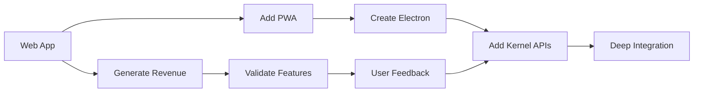
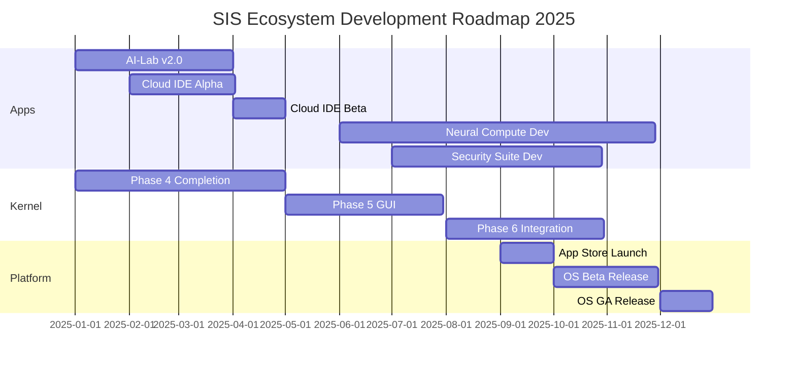

# SIS Ecosystem Architecture Documentation
> **Version:** 1.0.0  
> **Last Updated:** January 2025  
> **Status:** Active Development  
> **Classification:** Core Architecture Document

## 📋 Table of Contents
1. [Executive Summary](#executive-summary)
2. [Core Architecture](#core-architecture)
3. [Development Philosophy](#development-philosophy)
4. [Component Specifications](#component-specifications)
5. [Integration Strategy](#integration-strategy)
6. [Development Workflow](#development-workflow)
7. [Portfolio Management](#portfolio-management)
8. [Deployment Strategies](#deployment-strategies)
9. [Revenue Model](#revenue-model)
10. [Technical Standards](#technical-standards)
11. [Roadmap & Milestones](#roadmap--milestones)

---

## 🎯 Executive Summary

The SIS (Silicon Intelligence System) Ecosystem represents a revolutionary approach to operating system development through a **"Microservices-First OS Development Pattern"**. Instead of traditional monolithic OS development, we build standalone, revenue-generating SaaS applications that will eventually integrate into a unified operating system.

### Key Innovation
**Build the app ecosystem before the OS** - Each application is immediately valuable, generates revenue, and validates features before OS integration.

### Core Strategy
```
SaaS Apps → Immediate Revenue → User Validation → OS Integration
    ↓              ↓                   ↓                ↓
 30 days    Self-funding         Proven UX        When Ready
```

---

## 🏗️ Core Architecture

### System Components Overview
```
┌─────────────────────────────────────────────────────────────┐
│                     SIS ECOSYSTEM                           │
├─────────────────────────────────────────────────────────────┤
│                                                             │
│  ┌─────────────────────────────────────────────────────┐  │
│  │            SIS Apps Layer (Revenue Layer)           │  │
│  │  ┌──────────┐ ┌──────────┐ ┌──────────┐           │  │
│  │  │ AI-Lab   │ │ Cloud    │ │ Neural   │  More...  │  │
│  │  │ Platform │ │   IDE    │ │ Compute  │           │  │
│  │  └──────────┘ └──────────┘ └──────────┘           │  │
│  └─────────────────────────────────────────────────────┘  │
│                           ↕                                │
│  ┌─────────────────────────────────────────────────────┐  │
│  │         SIS Bridge (Integration Layer)              │  │
│  │  - Web API Gateway                                  │  │
│  │  - Native App Compiler                              │  │
│  │  - Kernel Service Interface                         │  │
│  └─────────────────────────────────────────────────────┘  │
│                           ↕                                │
│  ┌─────────────────────────────────────────────────────┐  │
│  │         SIS Kernel (OS Foundation)                  │  │
│  │  - Process Management                               │  │
│  │  - Memory Management                                │  │
│  │  - Device Drivers                                   │  │
│  │  - Network Stack                                    │  │
│  │  - Security Framework                               │  │
│  └─────────────────────────────────────────────────────┘  │
│                           ↕                                │
│  ┌─────────────────────────────────────────────────────┐  │
│  │            Hardware Abstraction Layer               │  │
│  │  - x86_64 / ARM64 / RISC-V Support                 │  │
│  └─────────────────────────────────────────────────────┘  │
└─────────────────────────────────────────────────────────────┘
```

### Component Relationships
```yaml
SIS_Kernel:
  status: Foundation Layer
  dependencies: None
  provides:
    - System calls
    - Process management
    - Hardware abstraction
    - Security primitives

SIS_Apps:
  status: Revenue Layer
  dependencies: None (standalone)
  provides:
    - User functionality
    - Revenue streams
    - Market validation
    - Feature testing

SIS_Bridge:
  status: Integration Layer
  dependencies: [SIS_Kernel, SIS_Apps]
  provides:
    - App-to-kernel communication
    - Native compilation
    - Resource management
    - Security sandboxing
```

---

## 🎓 Development Philosophy

### Core Principles

#### 1. **Standalone-First Development**
```javascript
// Every app must function independently
class SISApp {
  constructor() {
    this.dependencies = []; // No kernel dependencies
    this.revenue = 'self-contained'; // Own monetization
    this.deployment = 'immediate'; // Deploy anywhere
  }
}
```

#### 2. **Revenue-Driven Validation**
- Build features users will pay for
- Validate through actual usage
- Fund development through subscriptions
- No speculative features

#### 3. **Progressive Integration**
```
Level 0: Standalone Web App (immediate)
Level 1: PWA Installation (days)
Level 2: Electron Native (weeks)
Level 3: Kernel Integration (months)
Level 4: Deep OS Integration (when ready)
```

#### 4. **Zero-Dependency Architecture**
- Apps never require kernel to function
- Kernel never requires specific apps
- Bridge handles all integration complexity
- Graceful degradation at every level

### Development Mantras
1. **"Ship in 30 days or less"** - Every app idea to production
2. **"Revenue before integration"** - Prove value first
3. **"User feedback drives features"** - Not speculation
4. **"Parallel, not sequential"** - All teams move independently

---

## 📦 Component Specifications

### SIS Kernel Specification
```rust
// Location: /sis-kernel/kernel/
pub struct SISKernel {
    version: Version,
    architecture: Architecture,
    capabilities: Capabilities,
}

impl SISKernel {
    // Core subsystems
    process_manager: ProcessManager,
    memory_manager: MemoryManager,
    scheduler: Scheduler,
    vfs: VirtualFileSystem,
    network_stack: NetworkStack,
    security: SecurityFramework,
    
    // Hardware abstraction
    hal: HardwareAbstractionLayer,
    drivers: DriverManager,
    
    // Integration points
    pub fn register_app(&mut self, app: SISApp) -> Result<AppHandle>;
    pub fn expose_syscall(&self, call: SystemCall) -> Result<()>;
    pub fn provide_service(&self, service: KernelService) -> Result<()>;
}
```

### SIS App Specification
```typescript
// Standard SIS App Structure
interface SISApp {
  // Metadata
  id: string;
  name: string;
  version: SemVer;
  author: string;
  license: License;
  
  // Deployment
  deployment: {
    web: WebConfig;
    pwa?: PWAConfig;
    electron?: ElectronConfig;
    native?: NativeConfig;
  };
  
  // Monetization
  revenue: {
    model: 'subscription' | 'one-time' | 'usage-based' | 'free';
    tiers?: PricingTier[];
    billing?: BillingProvider;
  };
  
  // Integration
  integration: {
    level: 0 | 1 | 2 | 3 | 4;
    kernel_apis?: string[];
    permissions?: Permission[];
    sandbox?: SandboxConfig;
  };
  
  // Analytics
  analytics: {
    provider: 'mixpanel' | 'segment' | 'custom';
    events: TrackingEvent[];
    metrics: MetricDefinition[];
  };
}
```

### SIS Bridge Specification
```go
// Bridge provides bidirectional communication
type SISBridge struct {
    // Web to Kernel
    WebGateway     *WebGateway
    WSHandler      *WebSocketHandler
    RESTRouter     *RESTRouter
    
    // App compilation
    NativeCompiler *NativeCompiler
    WASMCompiler   *WASMCompiler
    
    // Resource management
    ResourceManager *ResourceManager
    PermissionManager *PermissionManager
    
    // Security
    Sandbox        *Sandbox
    Authenticator  *Authenticator
}

// Integration levels
const (
    WebView      = iota // Level 0: iframe/webview
    PWA                 // Level 1: installed PWA
    Electron            // Level 2: Electron app
    NativeAPI           // Level 3: Native with API
    KernelModule        // Level 4: Kernel module
)
```

---

## 🔄 Integration Strategy

### Progressive Integration Levels

#### Level 0: Web Application (Default)
```yaml
Description: Standalone web application
Deployment: Cloud hosting (Vercel, Netlify, AWS)
Access: Browser URL
Revenue: Direct SaaS subscriptions
Integration: None required
Example: https://ai-lab.sis.dev
```

#### Level 1: Progressive Web App
```yaml
Description: Installable web app
Deployment: PWA manifest + service worker
Access: Desktop/mobile install
Revenue: In-app purchases
Integration: Local storage, notifications
Example: Installed AI-Lab on desktop
```

#### Level 2: Native Application (Electron)
```yaml
Description: Native desktop application
Deployment: App stores, direct download
Access: OS application
Revenue: License key or subscription
Integration: File system, OS APIs
Example: SIS Cloud IDE native app
```

#### Level 3: Kernel-Aware Application
```yaml
Description: App with kernel API access
Deployment: SIS App Store
Access: Within SIS OS
Revenue: OS-integrated billing
Integration: Kernel services, IPC
Example: AI-Lab using kernel GPU scheduler
```

#### Level 4: Deep OS Integration
```yaml
Description: Core OS component
Deployment: Part of OS image
Access: System service/daemon
Revenue: Included in OS license
Integration: Full kernel access
Example: SIS Security Suite as system service
```

### Integration Workflow


---

## 🛠️ Development Workflow

### New App Creation Process

#### Step 1: Initialize App
```bash
# Create new SIS app from template
npx create-sis-app my-new-idea

# Template includes:
# - React/Vue/Svelte setup
# - Tailwind + SIS Design System
# - Authentication (Auth0/Clerk)
# - Billing (Stripe/Paddle)
# - Analytics (Mixpanel/Segment)
# - Deployment configs
# - PWA manifest
# - Electron configs
```

#### Step 2: Development Checklist
```markdown
## SIS App Development Checklist

### [ ] Foundation
- [ ] App idea validated
- [ ] Revenue model defined
- [ ] Target audience identified
- [ ] Competition analyzed

### [ ] Development
- [ ] Core features implemented
- [ ] Authentication integrated
- [ ] Billing system connected
- [ ] Analytics tracking added
- [ ] Error handling complete
- [ ] Tests written (>80% coverage)

### [ ] Deployment
- [ ] Domain configured
- [ ] SSL certificates
- [ ] CDN setup
- [ ] Database provisioned
- [ ] Environment variables set
- [ ] CI/CD pipeline configured

### [ ] Launch
- [ ] Landing page live
- [ ] Documentation written
- [ ] Support system ready
- [ ] Marketing materials prepared
- [ ] Beta users recruited
- [ ] Feedback loop established

### [ ] Integration Planning
- [ ] Kernel APIs identified
- [ ] Native features planned
- [ ] Security model defined
- [ ] Performance targets set
```

#### Step 3: Continuous Integration
```yaml
# .github/workflows/sis-app-ci.yml
name: SIS App CI/CD

on:
  push:
    branches: [main, develop]
  pull_request:
    branches: [main]

jobs:
  test:
    runs-on: ubuntu-latest
    steps:
      - uses: actions/checkout@v3
      - uses: actions/setup-node@v3
      - run: npm ci
      - run: npm test
      - run: npm run build
      
  deploy:
    needs: test
    if: github.ref == 'refs/heads/main'
    runs-on: ubuntu-latest
    steps:
      - uses: actions/checkout@v3
      - run: npm ci
      - run: npm run build
      - uses: vercel/action@v20
        with:
          vercel-token: ${{ secrets.VERCEL_TOKEN }}
          
  metrics:
    needs: deploy
    runs-on: ubuntu-latest
    steps:
      - run: |
          curl -X POST https://api.sis.dev/deployments \
            -H "Authorization: Bearer ${{ secrets.SIS_API_KEY }}" \
            -d '{"app": "${{ github.repository }}", "version": "${{ github.sha }}"}'
```

---

## 📊 Portfolio Management

### Portfolio Configuration
```yaml
# sis-apps-portfolio.yaml
version: "1.0"
updated: "2025-01-20"

portfolio:
  apps:
    # Production Apps
    - id: hybrid-ai-lab
      name: "SIS Hybrid AI-Lab"
      description: "Hardware-software co-design platform"
      status: production
      category: hardware
      tech_stack:
        frontend: [react, typescript, three.js]
        backend: [node.js, rust-wasm]
        database: [postgresql, redis]
      metrics:
        users: 1000+
        mrr: $50,000
        rating: 4.8/5
      integration:
        current_level: 0
        target_level: 3
        planned_date: "2025-Q3"
      repositories:
        - github.com/sis/ai-lab-frontend
        - github.com/sis/ai-lab-backend
      deployment:
        web: https://ai-lab.sis.dev
        api: https://api.ai-lab.sis.dev
        
    # In Development
    - id: cloud-ide
      name: "SIS Cloud IDE"
      description: "AI-powered development environment"
      status: development
      category: developer-tools
      tech_stack:
        frontend: [react, monaco-editor]
        backend: [node.js, kubernetes]
        database: [postgresql, s3]
      metrics:
        beta_users: 100
        target_launch: "2025-Q2"
        projected_mrr: $30,000
      integration:
        current_level: 0
        target_level: 4
        planned_date: "2025-Q4"
        
    # Planned Apps
    - id: neural-compute
      name: "SIS Neural Compute"
      description: "Distributed AI training platform"
      status: planned
      category: ai-ml
      estimated_development: "6 months"
      projected_mrr: $100,000
      
    - id: security-suite
      name: "SIS Security Suite"
      description: "Zero-trust security platform"
      status: planned
      category: security
      estimated_development: "4 months"
      projected_mrr: $75,000

  totals:
    active_apps: 1
    in_development: 1
    planned: 2
    total_mrr: $50,000
    projected_mrr: $255,000
    total_users: 1000+

  roadmap:
    2025_Q1:
      - "AI-Lab v2.0 release"
      - "Cloud IDE alpha launch"
    2025_Q2:
      - "Cloud IDE production launch"
      - "Neural Compute development start"
    2025_Q3:
      - "AI-Lab kernel integration"
      - "Security Suite development start"
    2025_Q4:
      - "SIS OS Beta with integrated apps"
      - "App Store launch"
```

### Portfolio Dashboard
```typescript
// Portfolio monitoring dashboard
interface PortfolioDashboard {
  apps: AppMetrics[];
  revenue: RevenueMetrics;
  users: UserMetrics;
  health: HealthMetrics;
}

interface AppMetrics {
  id: string;
  name: string;
  status: 'production' | 'development' | 'planned';
  users: number;
  revenue: number;
  uptime: number;
  errors: ErrorRate;
  performance: PerformanceMetrics;
}

interface RevenueMetrics {
  total_mrr: number;
  growth_rate: number;
  churn_rate: number;
  ltv: number;
  cac: number;
  projections: MonthlyProjection[];
}
```

---

## 🚀 Deployment Strategies

### Multi-Stage Deployment Pipeline

#### Stage 1: Standalone SaaS Deployment
```bash
# Deploy each app independently
deploy_saas() {
  app_name=$1
  
  # Build
  npm run build
  
  # Test
  npm test
  
  # Deploy to Vercel
  vercel --prod
  
  # Configure domain
  vercel domains add ${app_name}.sis.dev
  
  # Setup monitoring
  configure_monitoring ${app_name}
  
  # Enable analytics
  enable_analytics ${app_name}
}
```

#### Stage 2: Unified Platform Deployment
```yaml
# Platform-wide deployment
platform_deployment:
  components:
    - auth_service: https://auth.sis.dev
    - api_gateway: https://api.sis.dev
    - app_store: https://store.sis.dev
    
  apps:
    - name: ai-lab
      url: https://ai-lab.sis.dev
      api: https://api.ai-lab.sis.dev
      
    - name: cloud-ide
      url: https://ide.sis.dev
      api: https://api.ide.sis.dev
      
  infrastructure:
    cdn: cloudflare
    hosting: vercel
    database: neon.tech
    cache: redis-cloud
    monitoring: datadog
```

#### Stage 3: OS-Integrated Deployment
```rust
// OS deployment configuration
impl SISDeployment {
    fn deploy_to_os(&self) -> Result<(), Error> {
        // 1. Build kernel
        self.build_kernel()?;
        
        // 2. Compile native apps
        for app in self.apps {
            app.compile_native()?;
        }
        
        // 3. Create OS image
        let image = self.create_bootable_image()?;
        
        // 4. Deploy to targets
        match self.target {
            Target::CloudVM => self.deploy_to_cloud(),
            Target::BareMetal => self.deploy_to_hardware(),
            Target::Container => self.deploy_to_docker(),
        }
    }
}
```

### Deployment Environments
```yaml
environments:
  development:
    kernel: qemu-local
    apps: localhost:3000
    database: local-postgres
    
  staging:
    kernel: vm.staging.sis.dev
    apps: *.staging.sis.dev
    database: staging.db.sis.dev
    
  production:
    kernel: os.sis.dev
    apps: *.sis.dev
    database: db.sis.dev
    cdn: global.sis.dev
```

---

## 💰 Revenue Model

### Revenue Streams Architecture
```yaml
revenue_model:
  individual_apps:
    ai_lab:
      tiers:
        - name: Community
          price: $0
          limits: {projects: 3, synthesis: 100/month}
        - name: Pro
          price: $99/month
          limits: {projects: unlimited, synthesis: 1000/month}
        - name: Enterprise
          price: custom
          features: [sso, sla, support]
          
    cloud_ide:
      model: usage_based
      compute: $0.10/hour
      storage: $0.05/GB/month
      
    neural_compute:
      model: credits
      training: $1/GPU-hour
      inference: $0.01/1000-requests
      
  platform_bundles:
    startup:
      price: $199/month
      includes: [ai_lab.pro, cloud_ide.basic]
      
    enterprise:
      price: $999/month
      includes: all_apps
      features: [sso, api_access, priority_support]
      
  os_licensing:
    personal:
      price: $99
      lifetime: true
      updates: 1_year
      
    professional:
      price: $499
      lifetime: true
      updates: 3_years
      support: email
      
    enterprise:
      price: $2999/seat/year
      features: [volume_licensing, deployment_tools, sla]
      
  marketplace:
    transaction_fee: 15%
    listing_fee: $0
    featured_placement: $99/month
```

### Revenue Projections
```typescript
interface RevenueProjection {
  timeline: {
    month_1_6: {
      apps: ['ai-lab'],
      users: 1000,
      mrr: $50000,
    },
    month_7_12: {
      apps: ['ai-lab', 'cloud-ide'],
      users: 5000,
      mrr: $150000,
    },
    month_13_24: {
      apps: ['ai-lab', 'cloud-ide', 'neural-compute', 'security'],
      users: 20000,
      mrr: $500000,
      os_licenses: 1000,
    },
    year_3: {
      ecosystem_value: $10000000,
      annual_revenue: $12000000,
    }
  }
}
```

---

## 📐 Technical Standards

### Code Standards
```typescript
// All SIS apps must follow these standards

// 1. TypeScript Configuration
{
  "compilerOptions": {
    "strict": true,
    "noImplicitAny": true,
    "strictNullChecks": true,
    "target": "ES2022",
    "module": "ESNext"
  }
}

// 2. Component Structure
interface SISComponent {
  // Props must be typed
  props: ComponentProps;
  
  // State must use proper types
  state: ComponentState;
  
  // Methods must have return types
  render(): JSX.Element;
  
  // Lifecycle must be documented
  componentDidMount?(): void;
}

// 3. API Standards
interface SISAPI {
  version: 'v1' | 'v2';
  authentication: 'Bearer' | 'ApiKey';
  rateLimit: number;
  timeout: number;
  
  // All endpoints must return
  response: {
    success: boolean;
    data?: any;
    error?: ErrorResponse;
    metadata: ResponseMetadata;
  };
}
```

### Security Standards
```yaml
security_requirements:
  authentication:
    - OAuth2/OIDC required
    - MFA for enterprise
    - Session management
    - Token rotation
    
  authorization:
    - RBAC implementation
    - Principle of least privilege
    - API key scoping
    
  data_protection:
    - Encryption at rest (AES-256)
    - Encryption in transit (TLS 1.3)
    - PII handling compliance
    - GDPR/CCPA compliance
    
  code_security:
    - Dependency scanning
    - SAST/DAST testing
    - Security headers
    - CSP implementation
```

### Performance Standards
```yaml
performance_targets:
  web_apps:
    - First Contentful Paint: <1.2s
    - Time to Interactive: <3.5s
    - Lighthouse Score: >90
    - Bundle Size: <500KB initial
    
  api_endpoints:
    - Response Time p50: <100ms
    - Response Time p99: <1000ms
    - Uptime: 99.9%
    - Error Rate: <0.1%
    
  native_apps:
    - Startup Time: <2s
    - Memory Usage: <500MB
    - CPU Usage: <10% idle
    - Battery Impact: minimal
```

---

## 🗓️ Roadmap & Milestones

### 2025 Roadmap


### Key Milestones
```yaml
milestones:
  Q1_2025:
    - name: "AI-Lab Production Ready"
      date: 2025-02-15
      success_criteria:
        - 1000+ active users
        - $50K MRR
        - <0.1% error rate
        
  Q2_2025:
    - name: "Multi-App Platform"
      date: 2025-05-30
      success_criteria:
        - 2+ production apps
        - Unified authentication
        - Cross-app data sharing
        
  Q3_2025:
    - name: "Kernel Integration Beta"
      date: 2025-08-30
      success_criteria:
        - Apps running on SIS kernel
        - Native compilation working
        - Performance targets met
        
  Q4_2025:
    - name: "SIS OS Beta Launch"
      date: 2025-11-30
      success_criteria:
        - Bootable OS image
        - Integrated app ecosystem
        - 100+ beta testers
        
  2026_Q1:
    - name: "General Availability"
      date: 2026-03-01
      success_criteria:
        - Public OS release
        - App store operational
        - $1M ARR
```

---

## 📚 Appendices

### A. Quick Reference Commands
```bash
# Create new app
npx create-sis-app [app-name]

# Deploy app
npm run deploy:production

# Test kernel integration
npm run test:kernel-integration

# Build native version
npm run build:native

# Generate documentation
npm run docs:generate
```

### B. Contact & Resources
```yaml
resources:
  documentation: https://docs.sis.dev
  api_reference: https://api.sis.dev/docs
  github: https://github.com/sis-ecosystem
  discord: https://discord.gg/sis-dev
  email: dev@sis.dev
  
maintainers:
  - name: Core Team
    email: core@sis.dev
    github: @sis-core
    
  - name: Apps Team
    email: apps@sis.dev
    github: @sis-apps
    
  - name: Kernel Team
    email: kernel@sis.dev
    github: @sis-kernel
```

### C. Version History
```yaml
versions:
  - version: 1.0.0
    date: 2025-01-20
    author: SIS Architecture Team
    changes:
      - Initial architecture documentation
      - Defined core components
      - Established development standards
      - Created roadmap
```

---

## ✅ Document Validation

This document serves as the **single source of truth** for SIS Ecosystem development. All teams, developers, and AI agents should reference this document for:

- Architecture decisions
- Development standards
- Integration strategies
- Revenue models
- Deployment procedures
- Roadmap alignment

**Last Review:** January 20, 2025  
**Next Review:** February 20, 2025  
**Document Status:** ✅ Active and Authoritative

---

*This is a living document. Updates require approval from the SIS Architecture Board.*