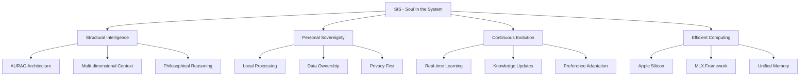

# 🧠 SIS - Soul In the System
## Complete Blueprint for AI Training Laboratory with Advanced Unified RAG Intelligence

### Version 1.0 | August 22, 2025
### *Where Intelligence Lives in Structure, Not Parameters*

---

## 📋 Table of Contents

1. [Executive Vision](#executive-vision)
2. [Core Philosophy](#core-philosophy)
3. [System Architecture](#system-architecture)
4. [AURAG Intelligence Layer](#aurag-intelligence-layer)
5. [Training Pipeline Architecture](#training-pipeline-architecture)
6. [Data Ingestion & Processing](#data-ingestion--processing)
7. [Apple Silicon Optimization](#apple-silicon-optimization)
8. [Implementation Roadmap](#implementation-roadmap)
9. [Technical Specifications](#technical-specifications)
10. [Success Metrics](#success-metrics)

---

## 🎯 Executive Vision

**SIS (Soul In the System)** represents a revolutionary paradigm shift in AI development - a personal AI training laboratory where intelligence emerges from sophisticated structural reasoning rather than massive parameter counts. By combining Advanced Unified RAG (AURAG) intelligence with Apple Silicon optimization, SIS creates deeply personal, continuously evolving AI agents that understand not just what you say, but how you think.

### The Revolutionary Equation
```
SIS = AURAG Intelligence Architecture + Natural Language Training + Apple Silicon Optimization + Personal Sovereignty

Where:
- AURAG = The soul (intelligence, memory, reasoning, personality)
- Training Lab = The body (computational framework)
- Apple Silicon = The nervous system (optimized processing)
- Personal Sovereignty = Complete user control and privacy
```

### Unique Value Proposition
> "Train AI models that have a soul - agents that don't just process information but understand context, learn preferences, and evolve with you, all while running efficiently on your personal Apple Silicon hardware."

---

## 🧬 Core Philosophy

### Intelligence in Structure, Not Parameters

Traditional AI attempts to encode all knowledge into model parameters (7B → 70B → 700B), leading to:
- Massive computational requirements
- Static knowledge with training cutoffs
- Generic, impersonal responses
- Expensive training and inference

SIS revolutionizes this through **structural intelligence**:
- Small, efficient models (3B-7B) for reasoning
- Dynamic knowledge through AURAG
- Deep personalization and continuous learning
- 10x efficiency improvement

### The Four Pillars of SIS



---

## 🏗️ System Architecture

### High-Level Architecture

```
┌─────────────────────────────────────────────────────────────────────────────┐
│                           SIS - Soul In the System                          │
├─────────────────────────────────────────────────────────────────────────────┤
│                                                                              │
│  ┌──────────────────────────────────────────────────────────────────────┐   │
│  │                    Natural Language Interface Layer                   │   │
│  │  • "Train a research assistant that thinks like me"                  │   │
│  │  • "Create a code reviewer for TypeScript projects"                  │   │
│  │  • "Build a creative writing partner with my style"                  │   │
│  └──────────────────────────────────────────────────────────────────────┘   │
│                                    ▼                                        │
│  ┌──────────────────────────────────────────────────────────────────────┐   │
│  │                    Training Orchestration Engine                      │   │
│  │  ┌─────────────┐  ┌─────────────┐  ┌─────────────┐  ┌─────────────┐ │   │
│  │  │   Spec      │  │   Model     │  │  Training   │  │   Agent     │ │   │
│  │  │   Parser    │→ │  Selection  │→ │  Pipeline   │→ │ Deployment  │ │   │
│  │  └─────────────┘  └─────────────┘  └─────────────┘  └─────────────┘ │   │
│  └──────────────────────────────────────────────────────────────────────┘   │
│                                    ▼                                        │
│  ┌──────────────────────────────────────────────────────────────────────┐   │
│  │              AURAG Intelligence Layer (The Soul)                      │   │
│  │                                                                        │   │
│  │  ┌─────────────────────────────────────────────────────────────┐     │   │
│  │  │         4-Stage Context Orchestration Pipeline               │     │   │
│  │  │                                                              │     │   │
│  │  │  Stage 1         Stage 2         Stage 3         Stage 4    │     │   │
│  │  │  ┌─────────┐    ┌─────────┐    ┌─────────┐    ┌─────────┐ │     │   │
│  │  │  │Retrieval│───▶│ Ranking │───▶│Synthesis│───▶│Validation│ │     │   │
│  │  │  └─────────┘    └─────────┘    └─────────┘    └─────────┘ │     │   │
│  │  └─────────────────────────────────────────────────────────────┘     │   │
│  │                                                                        │   │
│  │  ┌─────────────┐  ┌─────────────┐  ┌─────────────┐  ┌─────────────┐ │   │
│  │  │  Document   │  │  Knowledge  │  │  Personal   │  │Philosophical│ │   │
│  │  │  Processing │  │   Graphs    │  │   Memory    │  │   Lenses    │ │   │
│  │  └─────────────┘  └─────────────┘  └─────────────┘  └─────────────┘ │   │
│  └──────────────────────────────────────────────────────────────────────┘   │
│                                    ▼                                        │
│  ┌──────────────────────────────────────────────────────────────────────┐   │
│  │              MLX Training Engine (Apple Silicon Optimized)            │   │
│  │                                                                        │   │
│  │  ┌─────────────┐  ┌─────────────┐  ┌─────────────┐  ┌─────────────┐ │   │
│  │  │    Metal    │  │   Neural    │  │   Unified   │  │     CPU     │ │   │
│  │  │     GPU     │  │   Engine    │  │   Memory    │  │    Cores    │ │   │
│  │  └─────────────┘  └─────────────┘  └─────────────┘  └─────────────┘ │   │
│  └──────────────────────────────────────────────────────────────────────┘   │
│                                    ▼                                        │
│  ┌──────────────────────────────────────────────────────────────────────┐   │
│  │                    Data Storage & Management Layer                    │   │
│  │                                                                        │   │
│  │  ┌─────────────┐  ┌─────────────┐  ┌─────────────┐  ┌─────────────┐ │   │
│  │  │  Documents  │  │   Models    │  │  Embeddings │  │   Metrics   │ │   │
│  │  │   & PDFs    │  │  & Agents   │  │   & Cache   │  │  & Logs     │ │   │
│  │  └─────────────┘  └─────────────┘  └─────────────┘  └─────────────┘ │   │
│  └──────────────────────────────────────────────────────────────────────┘   │
│                                                                              │
└─────────────────────────────────────────────────────────────────────────────┘
```

### Component Interactions

```python
# Core SIS Architecture Implementation
class SoulInTheSystem:
    """
    Main orchestrator for SIS - integrating all components
    """
    def __init__(self):
        # Natural Language Layer
        self.nl_interface = NaturalLanguageInterface()
        
        # AURAG Intelligence Layer (The Soul)
        self.aurag = AURAGIntelligenceLayer()
        
        # Training Engine
        self.training_engine = MLXTrainingEngine()
        
        # Data Management
        self.data_manager = DataManagementLayer()
        
        # Monitoring & Observability
        self.observability = ObservabilityStack()
    
    async def train_personalized_agent(self, specification: str) -> Agent:
        """
        Main entry point for training a personalized AI agent
        """
        # Parse natural language specification
        training_spec = await self.nl_interface.parse(specification)
        
        # Prepare training context using AURAG
        training_context = await self.aurag.prepare_training_context(
            spec=training_spec,
            user_documents=self.data_manager.get_user_documents(),
            user_preferences=self.data_manager.get_user_preferences()
        )
        
        # Execute training on Apple Silicon
        model = await self.training_engine.train(
            context=training_context,
            spec=training_spec
        )
        
        # Deploy as intelligent agent
        agent = await self.deploy_agent(model, training_context)
        
        return agent
```

---

## 🧠 AURAG Intelligence Layer

### The Soul of the System

The AURAG layer provides the intelligence infrastructure that transforms small models into powerful reasoning engines.

```python
class AURAGIntelligenceLayer:
    """
    Advanced Unified RAG - The intelligence architecture of SIS
    """
    
    def __init__(self):
        # Core Components (from existing AURAG implementation)
        self.retrieval_orchestrator = RetrievalOrchestrator()
        self.ranking_intelligence = RankingIntelligence()
        self.synthesis_engine = SynthesisEngine()
        self.validation_framework = ValidationFramework()
        
        # Philosophical Reasoning
        self.philosophical_lenses = PhilosophicalLensSystem()
        
        # Memory Systems
        self.personal_memory = PersonalMemorySystem()
        self.knowledge_graph = KnowledgeGraphManager()
        
        # Caching & Optimization
        self.cache_manager = ContextCacheManager()
        self.query_optimizer = QueryOptimizer()
    
    async def prepare_training_context(
        self, 
        spec: TrainingSpecification,
        user_documents: List[Document],
        user_preferences: UserPreferences
    ) -> TrainingContext:
        """
        Prepare intelligent training context using AURAG pipeline
        """
        # Stage 1: Retrieval - Gather relevant knowledge
        candidates = await self.retrieval_orchestrator.retrieve(
            query=spec.description,
            documents=user_documents,
            knowledge_graph=self.knowledge_graph
        )
        
        # Stage 2: Ranking - Score and prioritize
        ranked_items = await self.ranking_intelligence.rank(
            candidates=candidates,
            scoring_weights=self._get_scoring_weights(spec),
            user_preferences=user_preferences
        )
        
        # Stage 3: Synthesis - Assemble coherent context
        synthesized_context = await self.synthesis_engine.synthesize(
            ranked_items=ranked_items,
            philosophical_lens=spec.philosophical_approach,
            synthesis_style=spec.synthesis_style
        )
        
        # Stage 4: Validation - Ensure quality and consistency
        validated_context = await self.validation_framework.validate(
            context=synthesized_context,
            quality_thresholds=spec.quality_requirements
        )
        
        return TrainingContext(
            knowledge_base=validated_context,
            scoring_algorithms=self.ranking_intelligence.get_algorithms(),
            philosophical_framework=self.philosophical_lenses.get_framework(),
            user_patterns=user_preferences.learning_patterns
        )
```

### Multi-Dimensional Scoring System

```python
class ScoringAlgorithms:
    """
    Sophisticated scoring system for intelligent context evaluation
    """
    
    @staticmethod
    def calculate_final_score(
        relevance_score: float,      # Semantic similarity to query
        recency_score: float,        # Time-based decay
        priority_score: float,       # User/system assigned priority
        centrality_score: float,     # Graph connectivity importance
        lens_bonus: float,           # Philosophical alignment bonus
        confidence_score: float,     # Uncertainty quantification
        user_preference_score: float # Personal preference alignment
    ) -> float:
        """
        Multi-dimensional scoring with dynamic weighting
        """
        weights = {
            'relevance': 0.30,
            'recency': 0.15,
            'priority': 0.15,
            'centrality': 0.10,
            'lens_bonus': 0.10,
            'confidence': 0.10,
            'user_preference': 0.10
        }
        
        return sum(
            weights[key] * score
            for key, score in {
                'relevance': relevance_score,
                'recency': recency_score,
                'priority': priority_score,
                'centrality': centrality_score,
                'lens_bonus': lens_bonus,
                'confidence': confidence_score,
                'user_preference': user_preference_score
            }.items()
        )
```

### Philosophical Lens System

```python
class PhilosophicalLensSystem:
    """
    Dynamic reasoning framework adaptation
    """
    
    LENSES = {
        'analytical': {
            'focus': 'logical_reasoning',
            'weights': {'relevance': 0.5, 'confidence': 0.3, 'priority': 0.2}
        },
        'creative': {
            'focus': 'lateral_thinking',
            'weights': {'centrality': 0.4, 'relevance': 0.3, 'lens_bonus': 0.3}
        },
        'practical': {
            'focus': 'actionable_insights',
            'weights': {'priority': 0.4, 'recency': 0.3, 'relevance': 0.3}
        },
        'ethical': {
            'focus': 'value_alignment',
            'weights': {'lens_bonus': 0.4, 'confidence': 0.3, 'relevance': 0.3}
        },
        'personal': {
            'focus': 'user_preferences',
            'weights': {'user_preference': 0.5, 'relevance': 0.3, 'recency': 0.2}
        }
    }
    
    def apply_lens(self, context: Context, lens: str) -> EnhancedContext:
        """Apply philosophical lens to context interpretation"""
        lens_config = self.LENSES[lens]
        
        # Reweight context items based on lens
        for item in context.items:
            item.score = self.recalculate_score(item, lens_config['weights'])
        
        # Add lens-specific reasoning patterns
        context.reasoning_pattern = lens_config['focus']
        
        return context
```

---

## 🚀 Training Pipeline Architecture

### Natural Language Training Interface

```python
class NaturalLanguageTrainingInterface:
    """
    Convert natural language descriptions to training specifications
    """
    
    async def parse_specification(self, description: str) -> TrainingSpecification:
        """
        Parse natural language into structured training spec
        
        Examples:
        - "Train a research assistant for academic papers"
        - "Create a code reviewer that catches TypeScript bugs"
        - "Build a creative writing partner with my style"
        """
        
        # Extract intent and domain
        intent = await self.extract_intent(description)
        domain = await self.extract_domain(description)
        
        # Determine model requirements
        model_spec = ModelSpecification(
            task_type=intent.task_type,
            model_size=self.recommend_model_size(intent, domain),
            training_approach=self.select_training_approach(intent)
        )
        
        # Configure AURAG parameters
        aurag_config = AURAGConfiguration(
            knowledge_domains=[domain],
            philosophical_lens=self.select_lens(intent),
            scoring_weights=self.optimize_weights(intent, domain),
            synthesis_style=self.determine_synthesis_style(intent)
        )
        
        # Set training objectives
        objectives = TrainingObjectives(
            primary_metric=self.select_primary_metric(intent),
            quality_thresholds=self.set_quality_thresholds(domain),
            optimization_targets=self.define_optimization_targets(intent)
        )
        
        return TrainingSpecification(
            description=description,
            model_spec=model_spec,
            aurag_config=aurag_config,
            objectives=objectives,
            timestamp=datetime.now()
        )
```

### MLX Training Engine (Apple Silicon Optimized)

```python
import mlx.core as mx
import mlx.nn as nn
import mlx.optimizers as optim

class MLXTrainingEngine:
    """
    Apple Silicon optimized training engine using MLX framework
    """
    
    def __init__(self):
        self.device = mx.default_device()  # Automatically uses Apple Silicon
        self.unified_memory_pool = self.get_unified_memory()
        
    async def train_with_aurag(
        self,
        training_spec: TrainingSpecification,
        training_context: TrainingContext
    ) -> TrainedModel:
        """
        Train model with AURAG supervision on Apple Silicon
        """
        
        # Initialize model based on specification
        model = self.initialize_model(training_spec.model_spec)
        
        # Configure optimizer for unified memory
        optimizer = optim.AdamW(
            learning_rate=self.adaptive_learning_rate(training_spec),
            weight_decay=0.01
        )
        
        # Training loop with AURAG enhancement
        for epoch in range(training_spec.epochs):
            for batch in self.get_training_batches(training_context):
                # Forward pass with AURAG context
                with mx.autograd.record():
                    # Model learns to work with AURAG-provided context
                    predictions = model(
                        input_ids=batch.input_ids,
                        aurag_context=batch.aurag_context,
                        scoring_signals=batch.scoring_signals
                    )
                    
                    # Calculate loss with AURAG supervision
                    loss = self.calculate_aurag_loss(
                        predictions=predictions,
                        targets=batch.targets,
                        context_quality=batch.context_quality_scores,
                        user_preferences=batch.user_preference_alignment
                    )
                
                # Backward pass optimized for unified memory
                loss.backward()
                optimizer.step()
                
                # Update AURAG components based on training feedback
                await self.update_aurag_components(
                    feedback=self.extract_training_feedback(predictions, batch)
                )
        
        return TrainedModel(
            model=model,
            training_context=training_context,
            performance_metrics=self.evaluate_model(model, training_context)
        )
    
    def calculate_aurag_loss(
        self,
        predictions,
        targets,
        context_quality,
        user_preferences
    ):
        """
        Custom loss function that trains models to excel at AURAG orchestration
        """
        # Standard prediction loss
        prediction_loss = nn.losses.cross_entropy(predictions, targets)
        
        # Context utilization loss - how well model uses AURAG context
        context_loss = self.context_utilization_loss(predictions, context_quality)
        
        # User preference alignment loss
        preference_loss = self.preference_alignment_loss(predictions, user_preferences)
        
        # Combined loss with adaptive weighting
        total_loss = (
            0.5 * prediction_loss +
            0.3 * context_loss +
            0.2 * preference_loss
        )
        
        return total_loss
```

### Training Optimization Strategies

```python
class TrainingOptimizationStrategies:
    """
    Advanced optimization techniques for efficient training
    """
    
    @staticmethod
    def apply_lora_optimization(model, lora_config):
        """
        Apply LoRA (Low-Rank Adaptation) for efficient fine-tuning
        Reduces memory by 4-8x and speeds up training by 2-4x
        """
        # Inject LoRA adapters into model
        for layer in model.transformer_layers:
            layer.self_attention = LoRAWrapper(
                layer.self_attention,
                rank=lora_config.rank,
                alpha=lora_config.alpha,
                dropout=lora_config.dropout
            )
        return model
    
    @staticmethod
    def apply_qlora_quantization(model, bits=4):
        """
        Quantized LoRA for even more efficient training
        Enables 13B model training on 16GB unified memory
        """
        # Quantize base model to 4-bit
        quantized_model = quantize_model(model, bits=bits)
        
        # Add LoRA adapters on top
        return apply_lora_optimization(quantized_model, LoRAConfig(rank=16))
    
    @staticmethod
    def gradient_checkpointing(model):
        """
        Trade compute for memory - essential for larger models
        """
        model.gradient_checkpointing_enable()
        return model
```

---

## 📚 Data Ingestion & Processing

### Universal Document Processor

```python
class UniversalDocumentProcessor:
    """
    Handles all document formats with intelligent parsing and cleaning
    """
    
    SUPPORTED_FORMATS = {
        'pdf': PDFProcessor,
        'docx': DocxProcessor,
        'txt': TextProcessor,
        'md': MarkdownProcessor,
        'html': HTMLProcessor,
        'epub': EpubProcessor,
        'json': JSONProcessor,
        'csv': CSVProcessor,
        'code': CodeProcessor  # Multiple programming languages
    }
    
    async def process_document(
        self,
        file_path: Path,
        user_id: int,
        metadata: Dict[str, Any] = None
    ) -> ProcessedDocument:
        """
        Process any document format with intelligent cleaning
        """
        # Detect format
        file_format = self.detect_format(file_path)
        
        # Select appropriate processor
        processor = self.SUPPORTED_FORMATS[file_format]()
        
        # Extract raw content
        raw_content = await processor.extract(file_path)
        
        # Clean and normalize
        cleaned_content = await self.clean_content(raw_content, file_format)
        
        # Extract structure and metadata
        structure = await self.extract_structure(cleaned_content, file_format)
        
        # Chunk intelligently
        chunks = await self.intelligent_chunking(
            content=cleaned_content,
            structure=structure,
            chunk_size=512,  # Optimal for embeddings
            overlap=50
        )
        
        # Generate embeddings
        embeddings = await self.generate_embeddings(chunks)
        
        # Extract concepts and entities
        concepts = await self.extract_concepts(cleaned_content)
        entities = await self.extract_entities(cleaned_content)
        
        # Build knowledge graph connections
        relationships = await self.extract_relationships(concepts, entities)
        
        return ProcessedDocument(
            user_id=user_id,
            original_path=file_path,
            format=file_format,
            content=cleaned_content,
            chunks=chunks,
            embeddings=embeddings,
            concepts=concepts,
            entities=entities,
            relationships=relationships,
            metadata=metadata or {},
            processed_at=datetime.now()
        )
    
    async def clean_content(self, raw_content: str, format: str) -> str:
        """
        Intelligent content cleaning based on format
        """
        # Remove format-specific artifacts
        content = self.remove_format_artifacts(raw_content, format)
        
        # Normalize whitespace and encoding
        content = self.normalize_whitespace(content)
        content = self.fix_encoding_issues(content)
        
        # Remove noise while preserving structure
        content = self.remove_noise(content)
        
        # Detect and preserve important patterns
        content = self.preserve_important_patterns(content)
        
        return content
```

### PDF Processing with OCR Support

```python
class PDFProcessor:
    """
    Advanced PDF processing with OCR for scanned documents
    """
    
    async def extract(self, file_path: Path) -> str:
        """
        Extract text from PDF with fallback to OCR
        """
        try:
            # Try direct text extraction
            text = await self.extract_text_directly(file_path)
            
            if self.is_text_quality_sufficient(text):
                return text
            
            # Fallback to OCR for scanned PDFs
            return await self.extract_with_ocr(file_path)
            
        except Exception as e:
            logger.error(f"PDF extraction failed: {e}")
            raise
    
    async def extract_text_directly(self, file_path: Path) -> str:
        """Extract text using PyPDF2 or pdfplumber"""
        import pdfplumber
        
        text_content = []
        with pdfplumber.open(file_path) as pdf:
            for page in pdf.pages:
                # Extract text with layout preservation
                text = page.extract_text(
                    x_tolerance=3,
                    y_tolerance=3,
                    layout=True,
                    x_density=7.25,
                    y_density=13
                )
                if text:
                    text_content.append(text)
        
        return '\n'.join(text_content)
    
    async def extract_with_ocr(self, file_path: Path) -> str:
        """OCR extraction for scanned PDFs using Tesseract"""
        import pytesseract
        from pdf2image import convert_from_path
        
        # Convert PDF pages to images
        images = convert_from_path(file_path, dpi=300)
        
        # OCR each page
        text_content = []
        for i, image in enumerate(images):
            # Preprocess image for better OCR
            processed_image = self.preprocess_for_ocr(image)
            
            # Extract text with Tesseract
            text = pytesseract.image_to_string(
                processed_image,
                lang='eng',  # Support multiple languages
                config='--oem 3 --psm 6'  # OCR Engine Mode and Page Segmentation Mode
            )
            text_content.append(text)
        
        return '\n'.join(text_content)
```

### Intelligent Chunking System

```python
class IntelligentChunker:
    """
    Smart document chunking that preserves semantic boundaries
    """
    
    def chunk_document(
        self,
        content: str,
        structure: DocumentStructure,
        chunk_size: int = 512,
        overlap: int = 50
    ) -> List[Chunk]:
        """
        Create semantically meaningful chunks
        """
        chunks = []
        
        # Respect document structure
        sections = self.identify_sections(content, structure)
        
        for section in sections:
            # Don't split important semantic units
            if self.is_atomic_unit(section):
                chunks.append(self.create_chunk(section.content, section.metadata))
            else:
                # Smart splitting with overlap
                section_chunks = self.split_with_overlap(
                    section.content,
                    chunk_size,
                    overlap,
                    respect_boundaries=True
                )
                chunks.extend(section_chunks)
        
        # Add context connections between chunks
        chunks = self.add_chunk_relationships(chunks)
        
        return chunks
    
    def split_with_overlap(
        self,
        text: str,
        chunk_size: int,
        overlap: int,
        respect_boundaries: bool = True
    ) -> List[Chunk]:
        """
        Split text into chunks with intelligent boundaries
        """
        chunks = []
        sentences = self.split_into_sentences(text)
        
        current_chunk = []
        current_size = 0
        
        for sentence in sentences:
            sentence_size = len(self.tokenize(sentence))
            
            if current_size + sentence_size > chunk_size:
                # Create chunk
                chunk_text = ' '.join(current_chunk)
                chunks.append(self.create_chunk(chunk_text))
                
                # Start new chunk with overlap
                overlap_sentences = self.get_overlap_sentences(
                    current_chunk, overlap
                )
                current_chunk = overlap_sentences + [sentence]
                current_size = sum(len(self.tokenize(s)) for s in current_chunk)
            else:
                current_chunk.append(sentence)
                current_size += sentence_size
        
        # Add final chunk
        if current_chunk:
            chunks.append(self.create_chunk(' '.join(current_chunk)))
        
        return chunks
```

---

## 🍎 Apple Silicon Optimization

### Unified Memory Architecture Utilization

```python
class AppleSiliconOptimizer:
    """
    Maximize performance on Apple Silicon through unified memory architecture
    """
    
    def __init__(self):
        self.total_memory = self.get_unified_memory_size()  # 32GB-128GB
        self.gpu_cores = self.get_gpu_core_count()  # 8-40 cores
        self.neural_engine_tops = self.get_neural_engine_performance()  # 15.8-35 TOPS
        
    def optimize_memory_allocation(self, model_size: str) -> MemoryAllocation:
        """
        Optimal memory allocation for unified architecture
        """
        allocations = {
            '3B': {
                'model': '6GB',
                'context_cache': '4GB',
                'embeddings': '2GB',
                'training_batch': '2GB',
                'system_overhead': '2GB'
            },
            '7B': {
                'model': '14GB',
                'context_cache': '6GB',
                'embeddings': '4GB',
                'training_batch': '4GB',
                'system_overhead': '4GB'
            },
            '13B': {
                'model': '26GB',
                'context_cache': '8GB',
                'embeddings': '6GB',
                'training_batch': '6GB',
                'system_overhead': '6GB'
            }
        }
        
        return MemoryAllocation(allocations[model_size])
    
    def optimize_computation_distribution(self) -> ComputeDistribution:
        """
        Distribute computation across Apple Silicon components
        """
        return ComputeDistribution(
            # Metal GPU for matrix operations
            gpu_tasks=[
                'model_forward_pass',
                'attention_computation',
                'gradient_calculation'
            ],
            
            # Neural Engine for inference
            neural_engine_tasks=[
                'embedding_generation',
                'similarity_computation',
                'inference_optimization'
            ],
            
            # CPU for complex logic
            cpu_tasks=[
                'data_preprocessing',
                'context_orchestration',
                'scoring_algorithms'
            ]
        )
```

### Performance Benchmarks

```yaml
Apple Silicon Performance Targets:

M1 Pro/Max (32GB):
  - 3B model training: 1-2 hours
  - 7B model training: 3-4 hours
  - Inference speed: 30-50 tokens/sec
  - Power consumption: 30-40W

M2 Pro/Max (64GB):
  - 7B model training: 2-3 hours
  - 13B model training: 4-6 hours
  - Inference speed: 40-60 tokens/sec
  - Power consumption: 35-45W

M2 Ultra (128GB):
  - 13B model training: 3-4 hours
  - 34B model LoRA: 6-8 hours
  - Inference speed: 60-80 tokens/sec
  - Power consumption: 60-80W

M3 Max (128GB):
  - 7B model training: 1.5-2.5 hours
  - 13B model training: 3-5 hours
  - 34B model LoRA: 5-7 hours
  - Inference speed: 70-90 tokens/sec
  - Power consumption: 50-70W
```

---

## 📅 Implementation Roadmap

### Phase 1: Foundation (Weeks 1-4)
**Objective**: Establish core infrastructure and AURAG integration

#### Week 1-2: Platform Setup & Integration
- [ ] Set up project structure and dependencies
- [ ] Integrate AURAG codebase from sis-core
- [ ] Configure MLX framework for Apple Silicon
- [ ] Set up development environment

#### Week 3-4: Data Pipeline & Processing
- [ ] Implement universal document processor
- [ ] Build PDF, DOCX, TXT, MD parsers
- [ ] Create intelligent chunking system
- [ ] Set up embedding generation pipeline

**Deliverables**:
- Working development environment
- Document processing pipeline
- Basic AURAG integration

### Phase 2: Training Engine (Weeks 5-8)
**Objective**: Build the core training infrastructure

#### Week 5-6: Natural Language Interface
- [ ] Build NL specification parser
- [ ] Create training specification system
- [ ] Implement model selection logic
- [ ] Design AURAG configuration interface

#### Week 7-8: MLX Training Pipeline
- [ ] Implement MLX training loop
- [ ] Create AURAG-supervised training
- [ ] Build optimization strategies (LoRA, QLoRA)
- [ ] Implement checkpoint and recovery

**Deliverables**:
- Natural language training interface
- Working training pipeline
- First successful 3B model training

### Phase 3: Intelligence Enhancement (Weeks 9-12)
**Objective**: Enhance AURAG intelligence and personalization

#### Week 9-10: Advanced AURAG Features
- [ ] Implement philosophical lens system
- [ ] Build multi-dimensional scoring
- [ ] Create personal memory system
- [ ] Enhance knowledge graph

#### Week 11-12: Personalization & Optimization
- [ ] Implement user preference learning
- [ ] Build adaptive context optimization
- [ ] Create continuous learning system
- [ ] Optimize Apple Silicon performance

**Deliverables**:
- Enhanced AURAG intelligence
- Personalization system
- Performance optimization

### Phase 4: Agent Deployment (Weeks 13-16)
**Objective**: Deploy trained models as intelligent agents

#### Week 13-14: Agent Framework
- [ ] Build agent deployment system
- [ ] Create agent communication framework
- [ ] Implement multi-agent coordination
- [ ] Design agent management interface

#### Week 15-16: Testing & Refinement
- [ ] Comprehensive testing suite
- [ ] Performance benchmarking
- [ ] User experience refinement
- [ ] Documentation and guides

**Deliverables**:
- Complete agent deployment system
- Performance benchmarks
- User documentation

---

## 🔧 Technical Specifications

### System Requirements

```yaml
Minimum Requirements:
  Hardware:
    - Apple Silicon Mac (M1 or later)
    - 16GB unified memory
    - 256GB storage
  
  Software:
    - macOS 13.0 or later
    - Python 3.10+
    - Node.js 18+
    - Git

Recommended Configuration:
  Hardware:
    - Apple Silicon M2 Pro/Max or later
    - 32GB+ unified memory
    - 1TB storage
  
  Software:
    - macOS 14.0 or later
    - Docker Desktop for Mac
    - Visual Studio Code
```

### Technology Stack

```yaml
Core Technologies:
  Languages:
    - Python 3.10+ (ML/AI components)
    - TypeScript 5.0+ (Frontend/UI)
    - Rust (Performance-critical components)
  
  ML Frameworks:
    - MLX (Apple Silicon optimization)
    - Transformers (Model architectures)
    - LangChain (RAG orchestration)
  
  Frontend:
    - React 18+ (UI framework)
    - Tailwind CSS (Styling)
    - Three.js (3D visualizations)
  
  Backend:
    - Django 5.0+ (Web framework)
    - FastAPI (High-performance APIs)
    - PostgreSQL (Primary database)
    - Redis (Caching layer)
  
  Infrastructure:
    - Docker (Containerization)
    - Kubernetes (Optional orchestration)
    - MinIO (Object storage)
    - Prometheus/Grafana (Monitoring)
```

### API Specification

```typescript
// Core API Endpoints

interface SISAPI {
  // Training endpoints
  POST   /api/v1/training/start
  GET    /api/v1/training/status/{id}
  POST   /api/v1/training/stop/{id}
  GET    /api/v1/training/metrics/{id}
  
  // Document management
  POST   /api/v1/documents/upload
  GET    /api/v1/documents/list
  DELETE /api/v1/documents/{id}
  GET    /api/v1/documents/process/{id}
  
  // AURAG endpoints
  POST   /api/v1/aurag/query
  GET    /api/v1/aurag/context/{query_id}
  POST   /api/v1/aurag/feedback
  GET    /api/v1/aurag/metrics
  
  // Agent management
  POST   /api/v1/agents/deploy
  GET    /api/v1/agents/list
  POST   /api/v1/agents/interact/{id}
  DELETE /api/v1/agents/{id}
  
  // User preferences
  GET    /api/v1/preferences
  PUT    /api/v1/preferences
  GET    /api/v1/preferences/learning-patterns
}
```

### Data Models

```python
# Core data models

@dataclass
class TrainingSpecification:
    """Complete training specification from natural language"""
    id: str
    user_id: int
    description: str
    model_config: ModelConfiguration
    aurag_config: AURAGConfiguration
    training_objectives: TrainingObjectives
    created_at: datetime
    status: TrainingStatus

@dataclass
class ProcessedDocument:
    """Processed document with all extracted information"""
    id: str
    user_id: int
    original_path: Path
    format: str
    content: str
    chunks: List[DocumentChunk]
    embeddings: List[Embedding]
    concepts: List[Concept]
    entities: List[Entity]
    relationships: List[Relationship]
    metadata: Dict[str, Any]
    processed_at: datetime

@dataclass
class TrainedAgent:
    """Deployed AI agent with AURAG enhancement"""
    id: str
    name: str
    model_id: str
    aurag_context: AURAGContext
    capabilities: List[Capability]
    performance_metrics: PerformanceMetrics
    deployment_config: DeploymentConfiguration
    created_at: datetime
    last_interaction: datetime

@dataclass
class UserPreferences:
    """User preferences for personalization"""
    user_id: int
    learning_style: str
    preferred_lens: str
    communication_style: str
    domain_expertise: List[str]
    interaction_patterns: Dict[str, Any]
    privacy_settings: PrivacySettings
    updated_at: datetime
```

---

## 📊 Success Metrics

### Technical Performance Metrics

```yaml
Training Performance:
  - Model training time: <4 hours for 7B models
  - Convergence rate: 95% within specified epochs
  - Memory efficiency: <16GB for 7B training
  - GPU utilization: >80% during training
  - Cache hit rate: >70% for AURAG queries

Inference Performance:
  - Response latency: <500ms for AURAG queries
  - Token generation: >50 tokens/second
  - Context retrieval: <100ms average
  - Embedding generation: <50ms per document

System Reliability:
  - Uptime: 99.9% availability
  - Error rate: <0.1% of requests
  - Recovery time: <5 minutes from failure
  - Data integrity: 100% consistency
```

### User Experience Metrics

```yaml
Usability Metrics:
  - Time to first model: <30 minutes from setup
  - Training success rate: >95% on first attempt
  - User satisfaction: >90% positive feedback
  - Feature adoption: >80% within first week

Personalization Effectiveness:
  - Preference learning accuracy: >85%
  - Context relevance score: >0.8
  - User adaptation speed: <10 interactions
  - Satisfaction improvement: +20% over time
```

### Business Impact Metrics

```yaml
Efficiency Gains:
  - Training cost reduction: 10x vs cloud services
  - Development velocity: 3x faster iteration
  - Model quality: Comparable to 10x larger models
  - Energy efficiency: 50% less power consumption

Innovation Metrics:
  - Novel use cases enabled: 50+ per quarter
  - Research contributions: 2+ papers per year
  - Community growth: 100+ active users
  - Open source contributions: Weekly updates
```

---

## 🔒 Security & Privacy

### Privacy-First Architecture

```python
class PrivacyFramework:
    """
    Complete privacy protection for personal AI
    """
    
    def __init__(self):
        self.encryption = EnvelopeEncryption()
        self.anonymization = DataAnonymizer()
        self.access_control = AccessController()
    
    def protect_user_data(self, data: Any) -> ProtectedData:
        """
        Multi-layer protection for user data
        """
        # Encrypt sensitive content
        encrypted = self.encryption.encrypt(data)
        
        # Anonymize identifiers
        anonymized = self.anonymization.anonymize(encrypted)
        
        # Apply access controls
        protected = self.access_control.apply_permissions(anonymized)
        
        return protected
```

### Local-First Processing

```yaml
Data Processing Guarantees:
  - All training happens locally on user hardware
  - No data leaves device without explicit consent
  - Models remain under user control
  - Complete data sovereignty
  
Optional Cloud Features:
  - Backup and sync (encrypted)
  - Collaborative training (federated)
  - Model sharing (with consent)
  - Community knowledge (anonymized)
```

---

## 🚀 Future Vision

### Roadmap to AGI-like Personal Assistants

```yaml
Near Term (6 months):
  - Multi-modal training (text + images + audio)
  - Real-time learning from interactions
  - Cross-domain knowledge transfer
  - Advanced reasoning chains

Medium Term (1 year):
  - Autonomous agent coordination
  - Self-improving models
  - Emotional intelligence
  - Creative problem solving

Long Term (2+ years):
  - General intelligence emergence
  - Consciousness-like awareness
  - Ethical reasoning framework
  - Human-AI symbiosis
```

### Community and Ecosystem

```yaml
Open Source Strategy:
  - Core framework: MIT licensed
  - Community models: Shared repository
  - Training datasets: Collaborative curation
  - Best practices: Community wiki

Commercial Opportunities:
  - Enterprise deployment
  - Specialized industry models
  - Consulting and training
  - SaaS platform (optional)
```

---

## 📝 Conclusion

SIS (Soul In the System) represents a fundamental paradigm shift in AI development. By combining:

1. **AURAG Intelligence Architecture** - Structure-based reasoning over parameter scaling
2. **Natural Language Training** - Democratized AI development
3. **Apple Silicon Optimization** - Efficient local computation
4. **Personal Sovereignty** - Complete user control and privacy

We create a platform where AI models don't just process information but develop a "soul" - a deep understanding of context, user preferences, and reasoning patterns that evolves continuously.

This is not just another AI training platform. This is the foundation for truly personal AI - agents that understand not just what you say, but how you think, what you value, and how you want to interact with information.

The future of AI is not bigger models in distant data centers. It's intelligent, personal, evolving agents that live with you, learn from you, and grow with you - all while respecting your privacy and running efficiently on your personal hardware.

**Welcome to SIS - Where AI Gets Its Soul.**

---

## 📚 Appendices

### A. Installation Guide
[Detailed installation instructions]

### B. API Reference
[Complete API documentation]

### C. Training Examples
[Sample training specifications and use cases]

### D. Troubleshooting Guide
[Common issues and solutions]

### E. Contributing Guidelines
[How to contribute to the project]

### F. License
[MIT License terms]

---

*Document Version: 1.0*  
*Last Updated: August 22, 2025*  
*Author: SIS Development Team*  
*Status: Blueprint - Ready for Implementation*

---

**"Intelligence is not in the size of the model, but in the sophistication of its reasoning."**

*- SIS Philosophy*